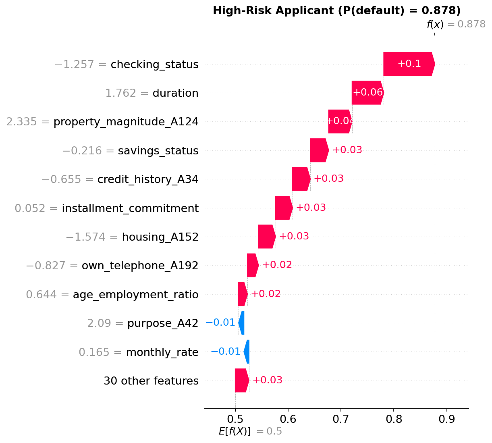
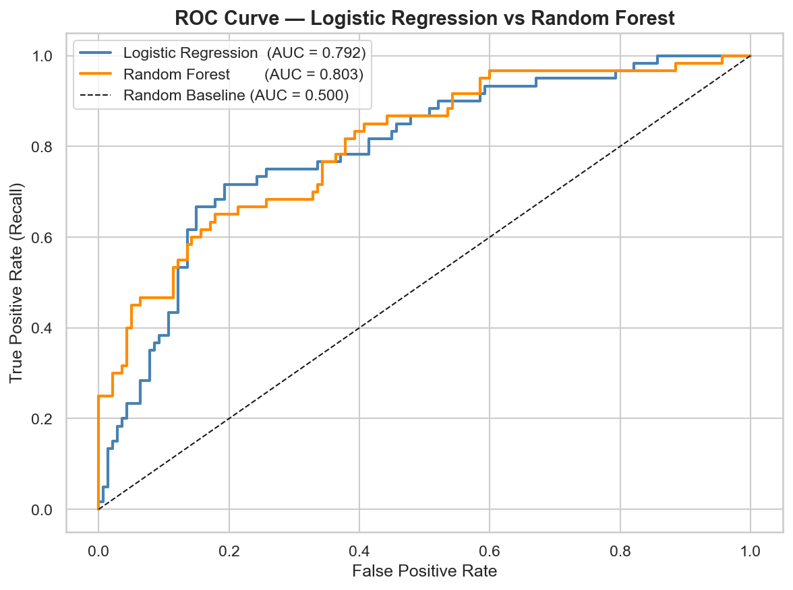
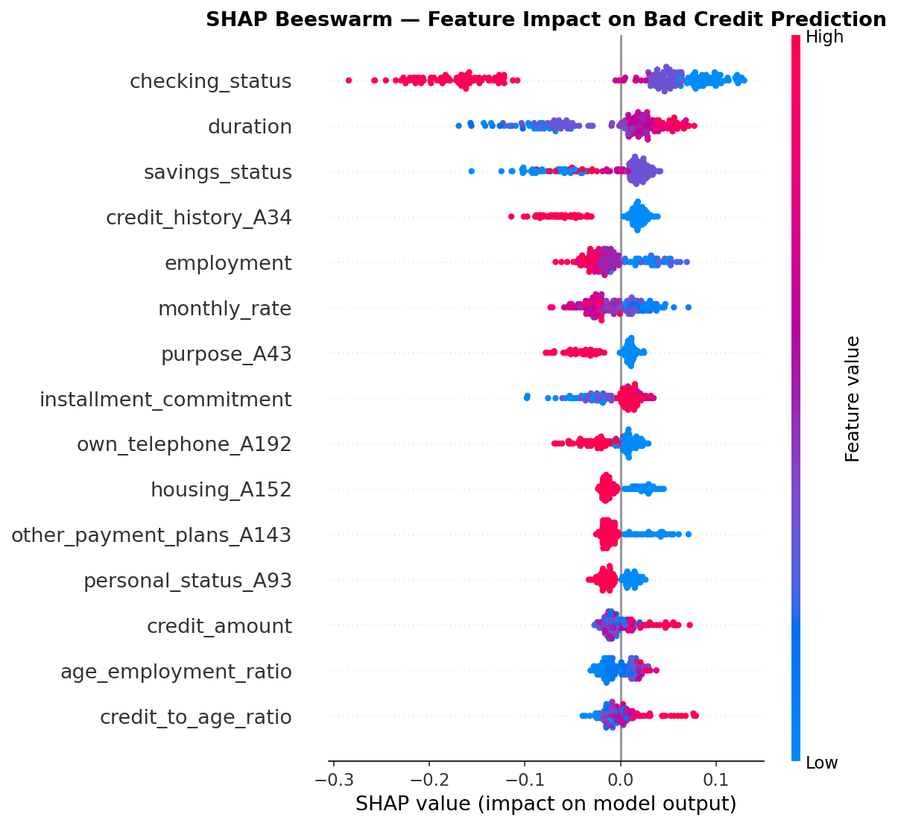
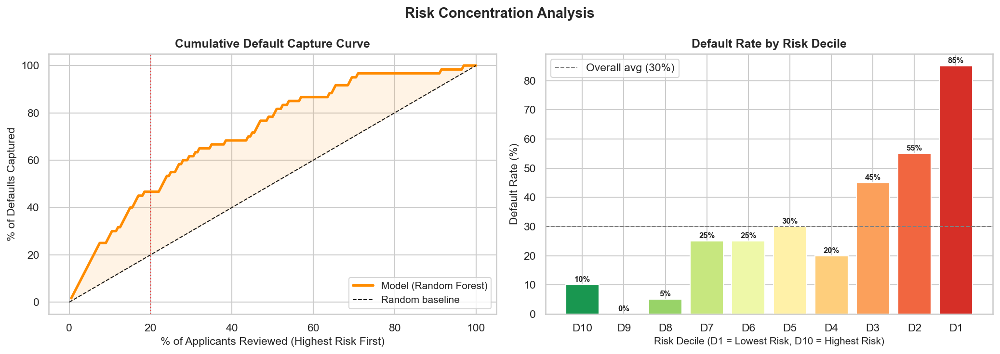
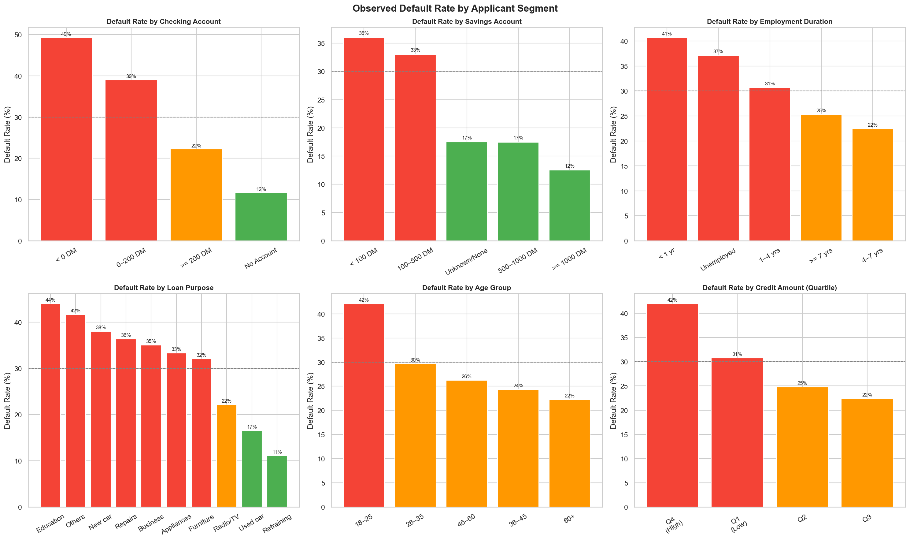
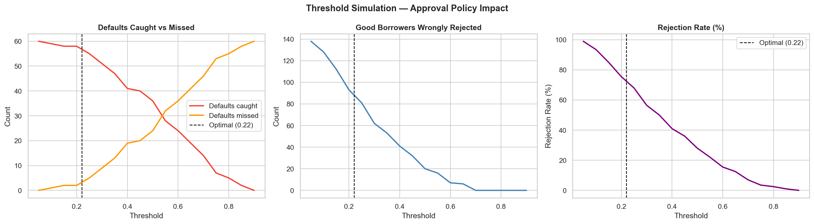

# 🏦 Credit Risk Scoring Model

> End-to-end machine learning project predicting loan default risk using the German Credit Dataset. Includes full EDA, feature engineering, model training, SHAP explainability, business insights, and a live Streamlit app.


---

## 🎯 Business Problem

Banks need to assess the creditworthiness of loan applicants to minimise default risk. This project builds an ML model that:
- Predicts whether an applicant is a **Good or Bad credit risk**
- Explains the **key factors driving each individual decision** (SHAP)
- Surfaces **quantified business insights** — threshold simulations, risk segmentation
- Delivers a **live web app** for real-time scoring

---

## 📊 Key Results

| Metric | Value |
|---|---|
| Model | Random Forest (300 trees) |
| ROC-AUC | **0.8035** |
| Optimal Threshold | 0.22 (cost-sensitive, 5:1 FN:FP penalty) |
| Top 20% riskiest applicants | capture **46.7%** of all defaults |
| Extra defaults caught vs default threshold | +see notebook |

---

## 🖼️ Screenshots

### Streamlit App — Live Prediction + SHAP Explanation


### ROC Curve — Model Comparison


### SHAP Beeswarm — Global Feature Importance


### Risk Concentration — Cumulative Default Capture


### Default Rate by Applicant Segment


### Threshold Simulation — Approval Policy Impact


---

## 🗂️ Project Structure

```
credit-risk-scoring-model/
├── data/
│   ├── raw/                    # Original UCI dataset (untouched)
│   └── processed/              # Cleaned data, model outputs, charts
├── notebooks/
│   ├── 01_eda.ipynb            # Exploratory Data Analysis
│   ├── 02_feature_engineering.ipynb  # Encoding, SMOTE, scaling
│   ├── 03_modeling.ipynb       # LR + RF training, evaluation, threshold tuning
│   ├── 04_shap_explainability.ipynb  # SHAP values, waterfall, beeswarm
│   └── 05_business_insights.ipynb   # Risk segmentation, threshold simulation
├── app/
│   └── app.py                  # Streamlit web application
├── docs/
│   └── LEARNING_JOURNAL.md     # Step-by-step explanation of every decision
├── requirements.txt
└── README.md
```

---

## 🔬 Methodology

### Phase 1 — EDA
- Class balance check (70% Good / 30% Bad)
- Numerical distributions, box plots vs target
- Categorical bad-credit rates per group
- Correlation heatmap, age-group risk analysis

### Phase 2 — Feature Engineering
- **Ordinal encoding** for ordered categoricals (checking_status, savings, employment, job)
- **One-hot encoding** for nominal categoricals (purpose, housing, credit_history, etc.)
- **3 engineered features**: `monthly_rate`, `age_employment_ratio`, `credit_to_age_ratio`
- **Log transform** for right-skewed features (`credit_amount`, `duration`)
- **Train/test split before scaling and SMOTE** (prevents data leakage)
- **SMOTE** applied only to training set to fix class imbalance

### Phase 3 — Modeling
- Logistic Regression baseline
- Random Forest (300 trees, min_samples_leaf=2)
- 5-fold cross-validation
- ROC curve + Precision-Recall curve comparison
- **Cost-sensitive threshold tuning** using the 5:1 FN:FP cost matrix from the dataset

### Phase 4 — SHAP Explainability
- `TreeExplainer` for exact SHAP values
- Global beeswarm plot (direction + magnitude for all features)
- Dependence plots for top features
- **Individual waterfall plots** — per-applicant explanation

### Phase 5 — Business Insights
- Risk score distribution + default rate by risk bucket
- Lorenz-style default capture curve by decile
- Threshold simulation table (defaults caught vs good borrowers rejected)
- Segment default rates (checking status, savings, employment, age, loan purpose)

### Phase 6 — Streamlit App
- Full applicant input form (20 features, human-readable dropdowns)
- Real-time prediction with probability + Approve/Reject decision
- Risk gauge bar
- Live SHAP waterfall explanation per applicant

---

## 🚀 Run Locally

```bash
git clone https://github.com/virend3rp/credit-risk-scoring-model
cd credit-risk-scoring-model

python3 -m venv venv
source venv/bin/activate
pip install -r requirements.txt

# Run notebooks in order (01 → 05) to regenerate model files
# Then launch the app:
cd app
streamlit run app.py
```

---

## 📁 Dataset

- **Source:** [UCI Statlog German Credit Data](https://archive.ics.uci.edu/dataset/144/statlog+german+credit+data)
- **Size:** 1,000 applicants, 20 features
- **Target:** Binary — Good Credit (1) / Bad Credit (2)
- **Notable:** Includes a cost matrix (FN costs 5× more than FP)

---

## 📌 Resume Bullet Points

- Built credit risk scoring model using Random Forest on German Credit dataset, achieving **ROC-AUC of 0.80**
- Engineered 20+ features, handled class imbalance via SMOTE, applied cost-sensitive threshold tuning using 5:1 FN penalty
- Identified that the top 20% riskiest applicants account for **46.7% of all defaults** via Lorenz-curve analysis
- Deployed end-to-end Streamlit app with real-time default prediction and **per-applicant SHAP explanation**
- Documented full methodology in a learning journal covering every design decision

---

## 📚 Learning Journal

Every step of this project — including **why** each decision was made — is documented in [`docs/LEARNING_JOURNAL.md`](docs/LEARNING_JOURNAL.md). Topics covered:

- Why SMOTE over undersampling
- Why split before scaling (data leakage)
- Why TreeExplainer over generic SHAP
- Why ROC-AUC over accuracy for imbalanced classes
- Cost-sensitive threshold tuning explained
- One-hot vs ordinal encoding decision logic
